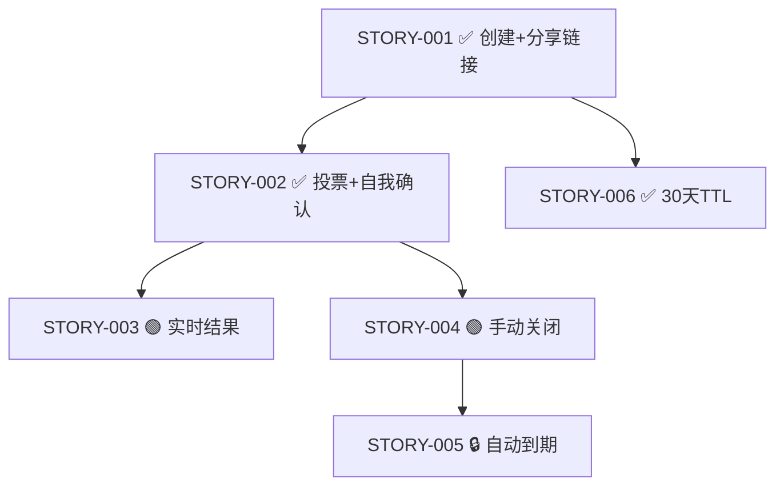

# tunan-story-graph — STORY 依赖图

> **何时用**：sponsor 想看某 PRD 下哪些 STORY 已 done / 阻塞谁 / 哪些能并行起；或贴到 PR 描述 / 设计文档里。

## 调用语法

```
/tunan-story-graph <PRD-id>                  # ASCII 默认
/tunan-story-graph <PRD-id> --mermaid        # mermaid 输出（可贴 GitHub / Notion）
/tunan-story-graph <PRD-id> --all-owners     # 不限 owner
```

> **必须**显式指明 `<PRD-id>`。多 PRD 仓库不允许"全展开"——单图只覆盖一个 PRD 的子图；跨 PRD 依赖单列于尾部。

## 流程

### 1. 定位 PRD 目录

<!-- MIRROR of tunan-prime §池结构；改前先改源 -->
- Glob `.tunan-workspace/sprints/SPT-*/reqs/REQ-*/<PRD-id>-*/` 找到 PRD 所在目录
- 读 `<PRD-id>-*.md` frontmatter 确认 `source_id` 是某个 REQ
- 未找到 → 报错 "PRD-NNN 不存在；用 /tunan-prime 看可用 PRD 列表"

### 2. 列 STORY

- Glob 该 PRD 目录下 `<STORY-*>/STORY-*.md`
- 对每个 STORY 读 frontmatter：`id / title / status / blocked_by / estimate / priority`

### 3. 分析依赖边

对每条 STORY 的 `blocked_by` 列表：
- **本 PRD 内**：作为 graph 实边（实箭头）
- **跨 PRD**：放到 "跨 PRD 依赖" 段，标注 `STORY-X (PRD-Y, 状态=Z)`

### 4. 渲染

#### ASCII（默认）

按拓扑序输出（无依赖在前，被依赖在后）；状态用 emoji 标识：
- ✅ done
- 🟢 ready（无依赖且 ready）
- ⏳ in_progress
- 🔒 blocked
- 🟡 failed

```
PRD-001: 轻量投票系统  (REQ-002, 2/6 STORY done)

STORY-001 ✅ done  创建+分享链接
    ↓ 解锁
    ├── STORY-002 ✅ done  投票+自我确认+软防重
    │      ↓ 解锁
    │      ├── STORY-003 🟢 ready  实时结果
    │      └── STORY-004 🟢 ready  手动关闭+只读
    │             ↓ 解锁
    │             └── STORY-005 🔒 blocked  自动到期
    └── STORY-006 ✅ done  30天 TTL

跨 PRD 依赖（如有）：
  (none)

汇总：done 3 / ready 2 / blocked 1 / in_progress 0 / failed 0
```

#### Mermaid（--mermaid）



### 5. 不可绕过的约束

- **不修改任何文件**（纯只读 skill，同 tunan-prime 精神）
- **不查 GitHub**（只看本地 frontmatter）；状态以 frontmatter 为准，如有偏差用 /tunan-prime 同步
- **不递归到 PLAN/TESTPLAN/PR**（图只到 STORY 粒度；要看链路用 /tunan-prime --verbose --id=STORY-NNN）

## 失败处理

<!-- MIRROR of tunan-prime §池结构；改前先改源 -->
- PRD 目录不存在 → 报错并列出 `.tunan-workspace/sprints/SPT-*/reqs/REQ-*/PRD-*/` 可见 PRD
- 某 STORY frontmatter 损坏 → 标 ❓ + 错误简述，不阻塞其他
- 检测到环依赖（A blocked_by B, B blocked_by A）→ 在图末标 ⚠ 环，列出环上的 STORY

## 反模式

- ❌ 不指定 PRD-id 默认全展开 → 多 PRD 时图爆炸
- ❌ 把状态翻成 done 因为图上看着像 → 本 skill 纯只读
- ❌ 把 PLAN/TESTPLAN/PR 节点画进图 → 颗粒度膨胀；那是 /tunan-prime --verbose 的事

## 接下来做什么

```
✅ PRD-NNN 图已渲染。

推荐下一步：
  1. ★ /tunan-parallel-pick   — 找 ready 节点中能并行的组合
  2. /tunan-plan <next-STORY>  — 拉 ready 节点中的下一个
  3. /tunan-prime              — 看跨 PRD 全貌
```
